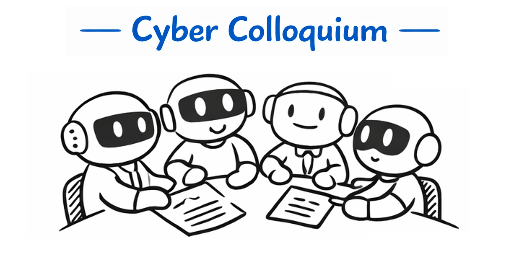
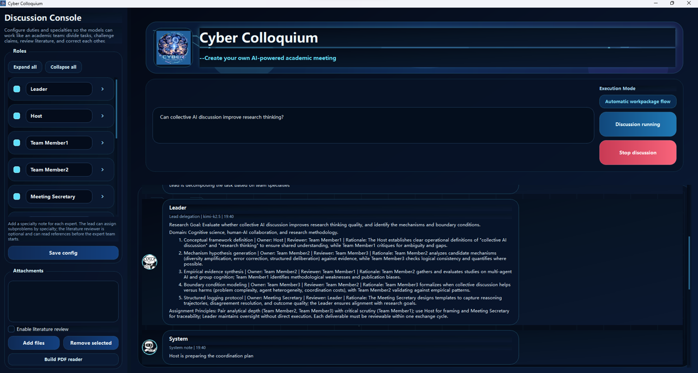
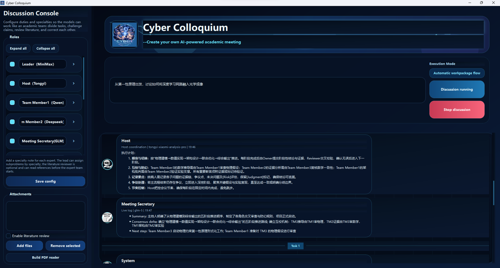

# Cyber Colloquium

<p align="center">
  
</p>

<p align="center">
  Create your own AI-powered academic meeting.
</p>

Welcome to Cyber Colloquium - a futuristic space where your research ideas become living academic conversations. Assemble your own AI-powered meeting, assign moderators, reviewers, and experts, and let them debate, question, and refine your work until rough intuition becomes structured insight.

Cyber Colloquium is a desktop app for running structured multi-LLM academic seminars with explicit roles, persistent research artifacts, and retrieval-aware PDF support. Instead of relying on a single long prompt and a single model response, you can orchestrate a collaborative AI team with distinct duties:

- `Lead`: decomposes the task and assigns work by specialty
- `Host`: coordinates the workflow and keeps the discussion on track
- `Expert`: handles domain subproblems and cross-checks claims
- `Literature Reviewer`: digests attached references before or during the discussion
- `Reporter`: logs the discussion in real time and writes final outputs

It is built for long-context research workflows: reading papers, revisiting figures and formulas, surfacing disagreements, cross-checking claims, and exporting the full discussion into reusable local artifacts.

## Why Cyber Colloquium

- Multi-role academic discussion instead of a single-chatbot workflow
- Optional literature-review stage before the main discussion begins
- PDF reader cache with indexed sections, figures, and formula candidates
- Real-time discussion feed with role-specific avatars and live status updates
- Structured meeting state designed to reduce token waste and improve consistency
- Local export of literature reviews, meeting minutes, research reports, and failure snapshots
- Provider-agnostic configuration for OpenAI-compatible chat endpoints

## Core Experience

- `Discussion Console`: configure model roles, duties, specialties, and API endpoints
- `Build PDF reader`: build a local cache from attached PDFs so the team can retrieve indexed sections, figures, and formulas during discussion
- `Discussion Feed`: follow the seminar as a live chat timeline with status updates, workpackage markers, and export notices

## Demo

### Live discussion interface

<p align="center">
  
</p>

### Discussion console and workflow setup

<p align="center">
  
</p>

## Project Structure

```text
.
|-- app.py
|-- app_config.example.json
|-- demo/
|-- requirements.txt
|-- Overall Picture.png
|-- post.png
|-- Profile Photo/
|-- src/
|   `-- discussion_app/
|       |-- attachments.py
|       |-- config.py
|       |-- llm_client.py
|       |-- main.py
|       |-- meeting_minutes.py
|       |-- models.py
|       |-- orchestrator.py
|       |-- pdf_reader.py
|       `-- ui.py
`-- ...
```

## Requirements

- Python 3.10+
- A Conda environment such as `myenv`
- One or more valid model API keys

Python dependencies:

- `PySide6`
- `requests`
- `pypdf`
- `pillow`

## Quick Start

```powershell
conda activate myenv
pip install -r requirements.txt
python app.py
```

If you are setting up the project for the first time:

1. Copy `app_config.example.json` to `app_config.json`
2. Fill in your own `base_url`, `model`, and `api_key`
3. Launch the app

## Provider Configuration

Each role in the UI can be configured independently:

- `Role name`: display name shown in the discussion feed
- `Duty`: Lead / Host / Expert / Literature Reviewer / Reporter
- `Specialty`: what the role is good at; the Lead uses this for delegation
- `Model`: the exact model name or endpoint identifier
- `Base URL`: provider base URL
- `API Key`: your private API key
- `Enable vision`: turn on image-aware discussion for providers that support it

The app works best with OpenAI-compatible chat endpoints.  
You can mix providers as long as their APIs accept the expected chat format.

## PDF Reader Workflow

The PDF reader is important for literature-heavy tasks.

When you click `Build PDF reader`, the app will:

1. Read attached PDFs locally
2. Build indexed section digests
3. Extract figure images when possible
4. Extract formula candidates from the PDF text
5. Save cache files under `pdf_reader/`

During discussion, the AI team can retrieve:

- section digests
- figure references
- formula references
- image attachments for vision-capable roles

If you update a PDF or switch to a different paper, rebuild the cache before starting a new discussion.

## Output Files

Generated outputs are saved locally and are ignored by Git by default.

- `meeting_minutes/meeting_minutes_*.md`
- `meeting_minutes/research_report_*.md`
- `meeting_minutes/literature_review_*.md`
- `meeting_minutes/discussion_failure_*.md`

## Customization

### Change the team background

You can adapt the app to different academic domains by editing:

- `specialty` fields in `app_config.json`
- role prompts in `src/discussion_app/orchestrator.py`
- UI wording in `src/discussion_app/ui.py`

### Change avatars

Put role images in `Profile Photo/`.  
The app matches images by role name or duty name.

Examples:

- `Lead.png`
- `Host.png`
- `Literature Reviewer.png`
- `Reporter.png`
- `Expert.png`

### Change branding

- `Overall Picture.png`: app icon and brand image
- `post.png`: GitHub poster / promotional visual

## Open-Source Checklist

Before pushing to GitHub:

1. Remove or rotate any real API keys
2. Commit `app_config.example.json`, not your private `app_config.json`
3. Keep generated outputs out of the repository unless you want to publish example artifacts
4. Rebuild screenshots or posters if branding changes

## Known Limitations

- Different providers have different context limits and response behaviors
- Some APIs may need provider-specific adapters beyond the OpenAI-compatible path
- Figure and formula extraction quality depends on the original PDF structure
- Very long discussions may still require prompt-budget tuning by provider

## License

This project is released under the [MIT License](LICENSE).
