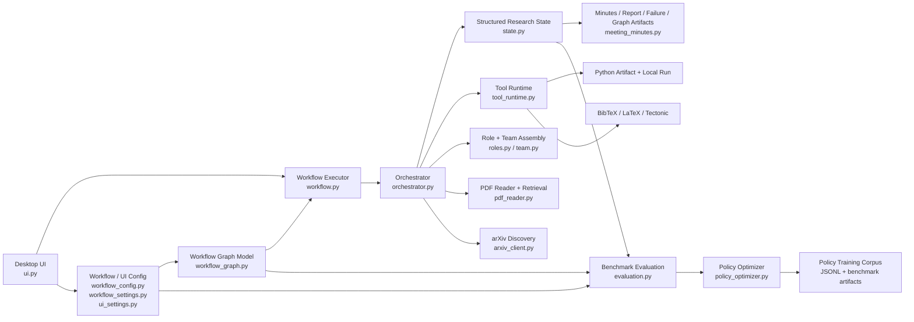
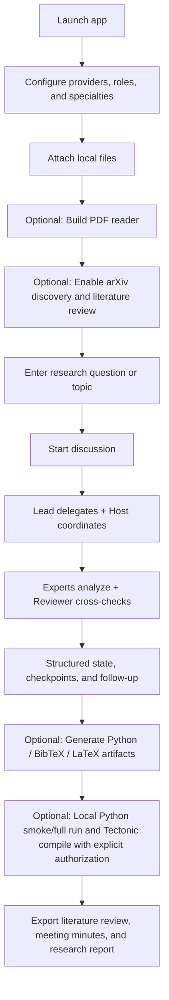
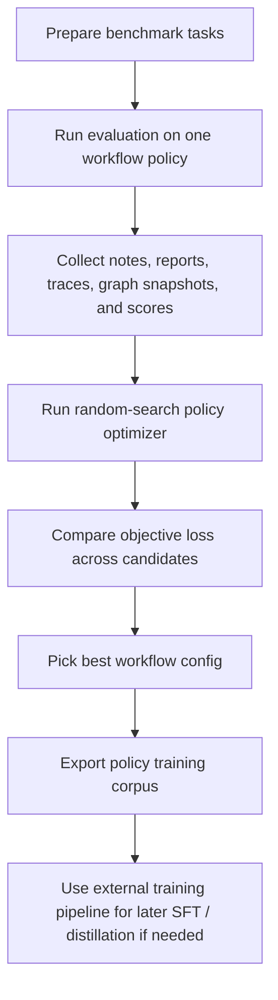

# Cyber Colloquium

<p align="center">
  
</p>

<p align="center">
  Create your own AI-powered academic meeting.
</p>

<p align="center">
  <a href="README.md">English</a> | <a href="README.zh-CN.md">中文</a>
</p>

Cyber Colloquium is a desktop research workspace that turns multiple LLMs into a coordinated academic team.

Instead of a single chat loop, the app organizes literature discovery, PDF reading, task decomposition, expert discussion, reviewer cross-checking, structured state tracking, experiment drafting, authorized local execution, and report writing inside one workflow-driven environment.

It is designed for research-heavy work where a single model is often not enough: reading papers, revisiting figures and formulas, debating methods, drafting code, validating execution, and exporting reusable research artifacts.

## What The App Does Now

Cyber Colloquium already supports a real vertical research workflow:

- search and download papers from arXiv
- attach local PDFs, text files, images, JSON, and CSV files
- build a local PDF reader cache for sections, figures, and formula candidates
- optionally generate a literature review before the main discussion starts
- let a `Lead` decompose the research task by specialty
- let a `Host` coordinate sequencing and follow-up rules
- let `Experts` handle concrete subproblems
- let a `Literature Reviewer` digest references and source grounding
- let a `Reporter` maintain structured meeting state and synthesize outputs
- generate Python experiment drafts
- run authorized local Python smoke tests and full runs inside isolated run workspaces
- generate BibTeX libraries and LaTeX drafts
- optionally compile LaTeX locally with Tectonic when the user authorizes local execution
- export meeting minutes, research reports, and failure snapshots

## End-To-End Workflow

The default workflow is `Research Discussion Review Workflow`.

### 1. Configure the team

In the desktop UI you can configure:

- role display names
- duty assignment: `Lead`, `Host`, `Expert`, `Literature Reviewer`, `Reporter`
- specialty notes
- model name
- base URL
- API key
- vision capability

### 2. Choose workflow policy

Workflow settings are editable from the UI and persisted to `workflow_config.json`.

Key switches now include:

- arXiv discovery on or off
- whether arXiv PDFs should be downloaded automatically
- maximum arXiv search results
- reviewer pass on or off
- Python artifact generation
- authorized local Python smoke test
- authorized local Python full run in the current interpreter
- Python timeout and mapped-input size limits
- BibTeX artifact generation
- LaTeX artifact generation
- authorized Tectonic compile
- enabled roles
- structured summary slots

### 3. Add materials and build the PDF reader

You can attach:

- PDF files
- text and markdown files
- JSON and CSV files
- images

The `Build PDF reader` action parses attached PDFs and writes cache files under `pdf_reader/`.

The cache includes:

- section indexing
- section digests
- figure extraction when possible
- figure summaries for vision-capable reviewer models
- formula candidate extraction

### 4. Optional arXiv discovery

If arXiv discovery is enabled, the workflow searches arXiv from the user request, stores paper metadata, optionally downloads PDFs, and registers those papers into the structured research state before source ingest continues.

Downloaded papers are saved under `arxiv_library/`.

### 5. Source ingest and literature review

The ingest stage prepares:

- user question
- local attachments
- downloaded arXiv papers
- PDF reader cache context
- optional literature review input

If `Enable literature review` is on and a literature-review provider is configured, the literature reviewer digests references before the main team proceeds.

### 6. Lead delegation and host coordination

The `Lead` reads the user request, team specialties, source snippets, and literature context, then outputs a structured delegation plan.

The `Host` turns the plan into an execution schedule and keeps the team aligned on cross-checking and follow-up rules.

### 7. Expert execution and reviewer pass

Experts work through assigned subproblems using:

- attachment snippets
- PDF reader retrieval
- literature review context
- structured meeting state

If reviewer participation is enabled, the reviewer cross-checks workpackages and challenges unsupported claims or weak reasoning.

### 8. Structured state consolidation

The discussion is consolidated into explicit structured state instead of relying on transcript memory alone.

The app tracks:

- consensus points
- conflicts or risks
- open questions
- action items
- evidence cards
- workflow tasks
- workflow stage records
- checkpoints
- literature library records
- experiment runs
- approval records
- generated artifacts

If open issues remain, the workflow can continue with follow-up passes instead of ending too early.

### 9. Experiment cycle

If Python artifact generation is enabled, the workflow generates a Python experiment draft from the structured state.

If local execution is also enabled in workflow settings and explicitly authorized for the current run, the app can perform:

- `python -m py_compile`
- an authorized `smoke` run
- an authorized `full` run

Both execution modes run inside a per-run isolated workspace under `generated_artifacts/execution_runs/`, so generated scripts do not execute directly inside the shared artifact directory.
The workspace also contains an `inputs/` directory and an `input_manifest.json` file so generated code can discover mapped attachments without relying on original absolute file paths.
The Python interpreter used for these runs is the same interpreter that launched the app, so if you start Cyber Colloquium from `myenv`, the generated code runs in `myenv`.

The outcome is written back into:

- structured experiment run records
- approval records
- generated run logs
- later meeting notes and final report context

### 10. Minutes, report, BibTeX, and LaTeX

At the end of the main workflow, the app can generate:

- meeting minutes
- research report
- BibTeX library
- LaTeX document draft

If Tectonic compile is enabled in workflow settings and the current run has local execution authorization, the app also attempts a local TeX build and stores the build log and compiled PDF when available.
The current compiler backend is `Tectonic`, with build outputs written to isolated folders under `generated_artifacts/latex_builds/`.

## Workflow Status: What Is Smooth vs. What Still Depends On Your Environment

### Smooth and already integrated

These pieces now form one connected research loop:

- arXiv discovery and metadata capture
- optional arXiv PDF download
- local attachment ingest
- PDF reader indexing and retrieval
- optional literature review
- lead delegation
- host coordination
- expert discussion
- reviewer cross-check
- structured state tracking
- experiment draft generation
- authorized local Python validation
- isolated per-run Python execution workspaces
- mapped execution inputs with manifest export
- meeting minutes export
- research report export
- BibTeX export
- LaTeX draft generation
- optional Tectonic compilation
- failure snapshot export
- dark and light themes

### Still intentionally bounded

These parts are connected, but not meant to be mistaken for full infrastructure:

- literature discovery is currently limited to arXiv
- Python execution is an authorized local validation step, not a sandboxed cluster runner
- experiment dependency installation is still your responsibility
- Python execution limits currently cover timeout and mapped-input size, not full OS-level sandboxing
- LaTeX compilation depends on `tectonic` being installed and available on `PATH`
- PDF extraction quality still depends on the original PDF structure
- figure and formula extraction are useful, but still imperfect
- there is no persistent database-backed project store yet

So the current version is already a serious vertical research workspace.

If your target is:

- `discover papers -> read -> discuss -> review -> write`, the workflow is already smooth
- `discover papers -> draft code -> run local validation -> compile paper assets`, the workflow is now connected but still environment-dependent
- `fully autonomous large-scale experimentation`, that remains future work

## Key Technical Ideas

Cyber Colloquium is not just "several models talking at once".

The current app is built around a few stronger ideas:

- graph-structured workflow execution instead of a hidden linear script
- workflow-stage execution instead of free-form multi-chat
- typed role mapping between duties and internal role archetypes
- structured meeting state instead of transcript-only memory
- retrieval-aware PDF support for sections, figures, and formulas
- explicit approval records for local execution
- artifact generation that feeds back into later stages
- experiment results written back into state before final reporting
- benchmark-driven policy scoring with multi-objective loss over quality, cost, latency, intervention, failure, and stability

That is what makes the app feel more like an AI research team than a stack of parallel model tabs.

## How Cyber Colloquium Differs From General-Purpose Agents

General-purpose autonomous agents such as OpenClaw-style systems usually optimize for broad tool use: browsing, coding, terminal operations, task automation, and open-ended step planning across many domains.

Cyber Colloquium is narrower by design and stronger inside that niche. It is built for research workflows rather than generic agent automation.

### In short

- a general-purpose agent is usually trying to solve many different kinds of tasks with one flexible loop
- Cyber Colloquium is trying to run a research project with a role-structured workflow

### Main differences

| Dimension | General-purpose agent | Cyber Colloquium |
| --- | --- | --- |
| Primary goal | Broad autonomous task execution | End-to-end research collaboration |
| Core unit of work | A single agent loop or planner/executor loop | A graph-structured multi-role research workflow |
| Memory model | Tool traces, messages, step history | Structured research state with consensus, conflicts, open questions, evidence, checkpoints, approvals, and experiment records |
| Literature handling | Usually optional or tool-dependent | Built-in arXiv discovery, PDF ingestion, PDF reader caching, and retrieval over sections, figures, and formulas |
| Collaboration style | One agent with tools, or loosely coordinated agents | Explicit `Lead`, `Host`, `Expert`, `Literature Reviewer`, and `Reporter` duties |
| Validation model | Often focuses on task completion | Focuses on reviewer passes, evidence grounding, checkpointing, and follow-up on unresolved issues |
| Execution safety | Varies by agent runtime | Local Python and Tectonic execution are explicitly gated by per-run user authorization |
| Output shape | Actions, patches, traces, or generic answers | Meeting minutes, research reports, BibTeX, LaTeX drafts, run logs, workflow graphs, and policy artifacts |
| Optimization path | Prompting and tool-use heuristics | Benchmarkable workflow graphs, multi-objective scoring, and policy search for research-team coordination |

### Why that matters

If you want a system that can operate like a general digital worker across arbitrary software tasks, a general-purpose agent is usually the better fit.

If you want a system that can:

- search and read papers
- decompose a research problem
- coordinate multiple specialist roles
- review claims against evidence
- draft code and papers
- run authorized local validation
- preserve the whole process as structured research artifacts

then Cyber Colloquium is solving a more specific problem.

So the difference is not "more models" versus "fewer models". The real difference is that Cyber Colloquium treats research itself as the product surface: literature, evidence, workflow state, experiments, review, and writing all live inside the same coordinated loop.

## Demo

### Live discussion interface

<p align="center">
  
</p>

### Discussion console and workflow setup

<p align="center">
  
</p>

## System Architecture



In practice:

- the UI controls providers, workflow settings, materials, and run authorization
- the workflow executor follows the configured workflow graph
- the orchestrator runs the AI team, tool calls, retrieval, and artifact generation
- the structured state is the shared memory layer across discussion, review, execution, and export
- the benchmark harness scores workflow quality
- the policy optimizer searches for stronger workflow configurations and exports supervision data for downstream training

## Architecture

The current codebase is split into extension-friendly layers:

- `src/discussion_app/ui.py`: desktop UI, workflow controls, per-run authorization, live discussion feed
- `src/discussion_app/orchestrator.py`: main orchestration layer and workflow stage handlers
- `src/discussion_app/workflow.py`: workflow executor and runtime context
- `src/discussion_app/workflow_config.py`: typed workflow, team, report, note, and tooling configuration
- `src/discussion_app/workflow_graph.py`: attribute-annotated workflow graph builder, Mermaid export, and grouped policy snapshot
- `src/discussion_app/workflow_settings.py`: UI-safe workflow settings adapter
- `src/discussion_app/ui_settings.py`: UI theme persistence
- `src/discussion_app/roles.py`: role registry and typed role definitions
- `src/discussion_app/team.py`: provider-to-role team assembly
- `src/discussion_app/state.py`: structured discussion state, checkpoints, papers, approvals, experiment runs, and artifact records
- `src/discussion_app/tool_runtime.py`: tool protocol, permission policy, registry, and artifact-generation tools
- `src/discussion_app/arxiv_client.py`: arXiv search, metadata parsing, PDF download, and BibTeX entry generation
- `src/discussion_app/pdf_reader.py`: PDF indexing, digest generation, figure extraction, and retrieval cache
- `src/discussion_app/meeting_minutes.py`: export rendering for literature review, minutes, report, and failure snapshots
- `src/discussion_app/evaluation.py`: benchmark harness and scoring utilities
- `src/discussion_app/policy_optimizer.py`: random-search workflow policy optimizer over the benchmark suite

## Configuration

### Provider configuration

Each provider can be configured independently:

- role display name
- duty
- specialty
- model
- base URL
- API key
- vision support

The current provider path expects OpenAI-compatible chat endpoints.

### Workflow configuration

Workflow settings are saved to `workflow_config.json`.

Important toggles now include:

- arXiv discovery
- automatic arXiv PDF download
- maximum arXiv results
- max discussion rounds
- checkpoint frequency
- reviewer pass
- enabled roles
- structured summary slots
- Python artifact generation
- local Python execution
- Python timeout and mapped-input limit
- BibTeX artifact generation
- LaTeX artifact generation
- local Tectonic compile
- workflow stage enablement

### UI configuration

The selected theme is saved to `ui_settings.json`.

## Outputs

### Discussion outputs

Generated under `meeting_minutes/`:

- `literature_review_*.md`
- `meeting_minutes_*.md`
- `research_report_*.md`
- `discussion_failure_*.md`
- `workflow_policy_*.json`
- `workflow_graph_*.json`
- `workflow_graph_*.mmd`

### Research artifacts

Generated on demand under `generated_artifacts/`:

- `*.py`
- `execution_runs/<project>/<run>/input_manifest.json`
- `*_run_log.txt`
- `*.bib`
- `*.tex`
- `*_tectonic_build_log.txt`
- `*.pdf` when local Tectonic build succeeds

### arXiv library

Generated under `arxiv_library/`:

- downloaded arXiv PDFs
- `arxiv_metadata.json`

### PDF reader outputs

Generated under `pdf_reader/`:

- section index JSON
- section digest JSON
- digest markdown
- extracted figure assets when available

### Benchmark outputs

Generated under `benchmarks/runs/`.

## Requirements

- Python 3.10+
- a Conda environment such as `myenv`
- one or more valid model API keys for real runs
- `tectonic` on `PATH` if you want automatic LaTeX compilation

Python dependencies:

- `PySide6`
- `requests`
- `pypdf`
- `pillow`

Known-good GUI runtime for this project at the moment:

- `PySide6==6.8.3`

## Quick Start

```powershell
conda activate myenv
pip install -r requirements.txt
python app.py
```

## Two Main Operating Modes

Cyber Colloquium now has two practical operating modes:

1. `Research discussion mode`
   - used for normal end-to-end research work inside the desktop app
   - input a topic or question
   - optionally discover arXiv papers
   - read references and discuss with the AI team
   - optionally generate Python / BibTeX / LaTeX artifacts
   - optionally run local Python smoke/full execution and local Tectonic compilation with explicit authorization

2. `Benchmark / policy tuning mode`
   - used to compare workflow policies and optimize the collaboration strategy itself
   - run benchmark tasks from the command line
   - score workflow quality with the multi-objective loss
   - export workflow graph artifacts, policy snapshots, traces, and a training corpus
   - use the exported corpus as downstream training data for later fine-tuning or distillation

Important boundary:

- the desktop app already supports benchmark-driven workflow optimization and training-corpus export
- it does **not** directly fine-tune the underlying model weights inside the UI
- if you want true model fine-tuning later, the current app is the data-generation and policy-search front end for that pipeline

## Mode A: Research Discussion Mode

This is the normal way to use the app as an AI research team.

### Flowchart



### Launch

```powershell
cd E:\大模型讨论\Cyber-Colloquium-main
conda activate myenv
python app.py
```

### Typical runtime flow

1. Configure providers, roles, specialties, models, and API keys.
2. Open `Workflow Policy` and decide whether to enable:
   - arXiv discovery
   - literature review
   - reviewer pass
   - Python artifact generation
   - BibTeX / LaTeX artifact generation
   - local execution for this run
3. Attach local materials such as PDF, text, JSON, CSV, or images.
4. If PDFs are attached, optionally click `Build PDF reader` first.
5. Enter the research topic, problem, or discussion goal.
6. Click `Start discussion`.
7. The app then runs the default workflow:
   - discover arXiv literature if enabled
   - ingest source material
   - run lead / host / expert / reviewer collaboration
   - update structured state and checkpoints
   - optionally generate Python artifacts, smoke-test them, and fully run them
   - generate meeting notes and research report
   - optionally generate BibTeX / LaTeX and compile with Tectonic
8. Review outputs under:
   - `meeting_minutes/`
   - `generated_artifacts/`
   - `arxiv_library/`
   - `pdf_reader/`

### When to use this mode

Use `Research discussion mode` when your main goal is:

- reading papers
- discussing a research direction
- reviewing a method
- planning an experiment
- generating a report or paper draft
- validating generated code with explicit local authorization

## Mode B: Benchmark / Policy Tuning Mode

This mode is for improving the multi-AI collaboration workflow itself.

### Flowchart



### Step 1: Prepare benchmark tasks

Benchmark tasks live under:

- `benchmarks/tasks/train/`
- `benchmarks/tasks/dev/`
- `benchmarks/tasks/holdout/`

Each task defines:

- the input topic / PDF / summary seed
- the required outputs
- the scoring constraints
- the benchmark split and metadata

### Step 2: Evaluate one workflow policy

Run one policy version against a benchmark split:

```powershell
cd E:\大模型讨论\Cyber-Colloquium-main
conda activate myenv
python -m src.discussion_app.evaluation --tasks-root benchmarks/tasks --split train --policy-version local_smoke
```

Useful flags:

- `--workflow-config path/to/workflow_config.json`
- `--output-root benchmarks/runs`
- `--limit 1`
- `--quality-weight 1.0`
- `--cost-weight 0.2`
- `--latency-weight 0.15`
- `--human-weight 0.1`
- `--failure-weight 0.8`
- `--stability-weight 0.2`

This produces:

- benchmark result JSON
- suite summary JSON
- workflow graph JSON
- workflow graph Mermaid file
- grouped workflow policy snapshot
- execution trace
- meeting notes and research report copies for that run

### Step 3: Search better workflow policies

Run random-search workflow optimization:

```powershell
cd E:\大模型讨论\Cyber-Colloquium-main
conda activate myenv
python -m src.discussion_app.policy_optimizer --tasks-root benchmarks/tasks --split train --samples 6
```

This compares multiple workflow policy candidates by changing parameters such as:

- max discussion rounds
- checkpoint frequency
- reviewer on/off
- structured summary slots
- context limits
- evidence and log budgets
- follow-up depth

The optimizer writes:

- per-candidate workflow configs
- benchmark run artifacts per candidate
- `policy_search_summary.json`
- `policy_training_corpus.jsonl`

### Step 4: Use the exported corpus for downstream training

The current app already exports a policy-oriented training corpus that includes:

- benchmark input/task metadata
- config snapshot
- grouped policy snapshot
- workflow graph
- objective metrics and scores

This is the recommended bridge to later model adaptation work.

In other words:

- use Cyber Colloquium to generate structured benchmark traces and workflow-policy supervision
- use external training code to perform actual fine-tuning, SFT, preference optimization, or distillation on top of that corpus

## Tectonic Setup

Cyber Colloquium uses `tectonic` as the local TeX compiler backend. The app does not bundle Tectonic by itself; it expects the `tectonic` executable to be available on your system `PATH`.

Official references:

- [Tectonic installation guide](https://tectonic-typesetting.github.io/book/latest/installation/)
- [Tectonic CLI build reference](https://tectonic-typesetting.github.io/book/latest/v2cli/build.html)

### Recommended setup for this project

If you already use the `myenv` Conda environment, the simplest setup is:

```powershell
conda activate myenv
conda install -c conda-forge tectonic
```

After installation, verify that the compiler is available:

```powershell
tectonic --help
tectonic --version
where.exe tectonic
```

If both commands work, Cyber Colloquium should detect Tectonic automatically at startup.

### Official Windows installer option

The official Tectonic documentation also provides a PowerShell installer for Windows. If you use that method, make sure that the unpacked `tectonic.exe` is moved into a directory that is included in your system `PATH`; otherwise the app will not be able to find it.

### How the app checks Tectonic

At startup, the app runs an environment check:

- if `tectonic` is found on `PATH`, the UI will show `Tectonic detected`
- if `tectonic` is not found, the UI will warn that local LaTeX compilation will be skipped

### How to enable Tectonic inside the app

Tectonic compilation requires two conditions:

1. In `Workflow Policy -> Edit workflow settings`, enable:
   - `Generate LaTeX document draft after the report stage`
   - `Allow local Tectonic compile after draft generation`
2. For the current run, check:
   - `Authorize local execution for this run`

Only when both are enabled will the app try to build the generated `.tex` file locally.

### Current output location

Successful or attempted Tectonic builds are written under:

- `generated_artifacts/latex_builds/`

Typical outputs include:

- compiled PDF
- Tectonic build log
- intermediate build folder for that run

### When to use this mode

Use `Benchmark / policy tuning mode` when your main goal is:

- improving multi-AI collaboration quality
- comparing workflow policies systematically
- reducing cost / latency / intervention while preserving output quality
- building a small but reusable benchmark set
- exporting structured supervision data for later fine-tuning

Recommended first run:

1. open the app
2. configure providers and API keys
3. attach one or more source files
4. optionally enable arXiv discovery in workflow settings
5. optionally click `Build PDF reader`
6. optionally enable literature review
7. review the startup environment check for `tectonic`
8. if you want local execution, check the per-run authorization box
9. start the discussion

## Benchmark Harness

Run the evaluation harness from the command line:

```powershell
conda run -n myenv python -m src.discussion_app.evaluation --tasks-root benchmarks/tasks --split train --policy-version local_smoke
```

Useful flags:

- `--workflow-config path/to/workflow_config.json`
- `--output-root benchmarks/runs`
- `--limit 1`
- `--quality-weight 1.0 --cost-weight 0.2 --latency-weight 0.15`

Run random-search workflow policy tuning against the benchmark suite:

```powershell
conda run -n myenv python -m src.discussion_app.policy_optimizer --tasks-root benchmarks/tasks --split train --samples 6
```

This writes:

- per-candidate workflow configs
- benchmark run artifacts
- workflow graph / policy snapshots
- `policy_training_corpus.jsonl`
- `policy_search_summary.json`

## Known Limitations

- arXiv is the only built-in remote literature source right now
- local execution remains intentionally explicit and user-authorized
- generated Python scripts are scaffolds and validation targets, not guaranteed full experiments
- automatic dependency installation is out of scope
- local LaTeX compilation depends on `tectonic` being installed
- Python workspace limits currently do not enforce full memory or CPU quotas at the OS level
- provider behavior still varies across vendors even with OpenAI-compatible APIs
- PDF extraction quality depends on the original PDF structure
- figure and formula extraction remain imperfect
- there is no persistent database-backed project memory yet

## License

This project is released under the [MIT License](LICENSE).


