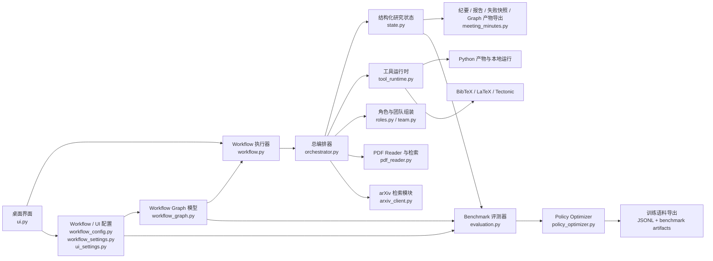
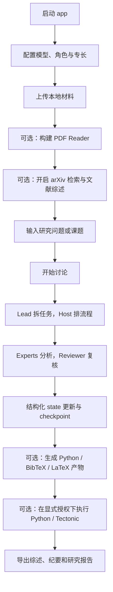
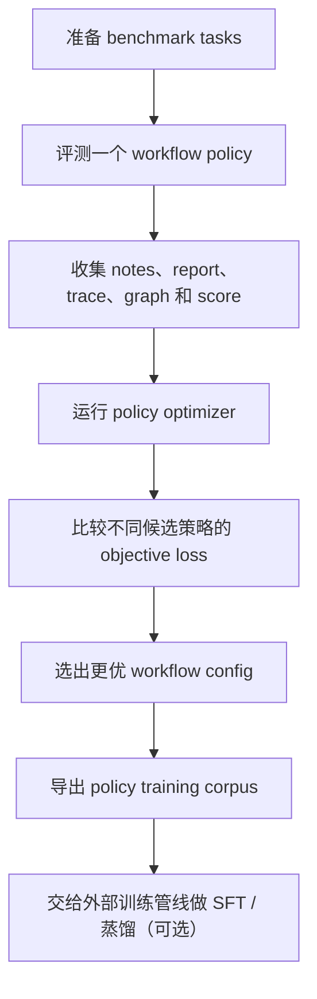

# Cyber Colloquium

<p align="center">
  
</p>

<p align="center">
  Create your own AI-powered academic meeting.
</p>

<p align="center">
  <a href="README.md">English</a> | <a href="README.zh-CN.md">中文</a>
</p>

Cyber Colloquium 是一个面向科研场景的桌面工作台。它不是单一模型的一问一答界面，而是把多个大模型组织成一个可分工、可检索、可复核、可导出的 AI 研究团队。

它当前支持将以下环节串成一条工作流：

- arXiv 文献检索与下载
- 本地 PDF / 文本 / 图片 / JSON / CSV 材料接入
- PDF Reader 索引构建与章节 / 图示 / 公式检索
- 多角色讨论、复核与结构化状态跟踪
- Python 实验草稿生成与授权后本地运行测试
- BibTeX / LaTeX 草稿生成与授权后 Tectonic 编译
- 会议纪要、研究报告、失败快照、workflow graph / policy artifact 导出

## 当前能做什么

Cyber Colloquium 现在已经具备较完整的科研垂直工作流：

- 根据问题自动检索 arXiv 文献
- 下载并登记论文元数据
- 让文献综述专家先整理参考文献
- 让 Lead 拆解任务、Host 协调流程、Experts 执行分析、Reviewer 复核、Reporter 统稿
- 用结构化 state 记录共识、争议、未决问题、行动项、证据卡片、checkpoint、实验记录和审批记录
- 生成 Python / BibTeX / LaTeX 产物
- 在用户授权下执行本地 Python smoke test 和本地 Tectonic 编译
- 输出研究报告、会议纪要和失败快照

## 系统架构图



这套结构的核心关系是：

- UI 负责配置、材料接入、运行授权和实时展示
- workflow executor 按显式 workflow graph 推进阶段
- orchestrator 负责多 AI 协作、检索、工具调用和产物生成
- structured state 是讨论、复核、实验和导出的共享状态层
- evaluation 负责 benchmark 评测
- policy optimizer 负责搜索更好的 workflow policy，并导出后续训练可用的数据

## Cyber Colloquium 与通用 Agent 的区别

像 OpenClaw 这一类通用自主 Agent，通常更强调广义工具使用能力：浏览网页、写代码、操作终端、执行自动化任务，以及在不同领域中做开放式步骤规划。

Cyber Colloquium 的定位更窄，但在这个方向上更深。它不是为了覆盖尽可能多的任务类型，而是专门为科研工作流设计的。

### 一句话概括

- 通用 Agent 往往希望用一套灵活的 agent loop 去处理尽可能多的任务
- Cyber Colloquium 更像是在运行一个带角色分工的科研项目流程

### 主要差异

| 维度 | 通用 Agent | Cyber Colloquium |
| --- | --- | --- |
| 主要目标 | 广义任务自动化与执行 | 端到端科研协作 |
| 核心工作单元 | 单 Agent loop，或 planner / executor loop | 图结构、多角色的科研 workflow |
| 状态与记忆 | 工具调用轨迹、消息历史、步骤记录 | 结构化研究状态：共识、争议、未决问题、证据、checkpoint、审批记录、实验记录 |
| 文献处理 | 通常是可选能力，取决于外部工具接入 | 内建 arXiv 检索、PDF 接入、PDF Reader 缓存，以及对章节、图示、公式的检索 |
| 协作方式 | 单 Agent 带工具，或多个 Agent 的松散协作 | 明确区分 `Lead`、`Host`、`Expert`、`Literature Reviewer`、`Reporter` |
| 验证机制 | 更关注任务是否完成 | 更关注 reviewer pass、证据绑定、checkpoint 和记留未决问题后的继续深挖 |
| 执行安全 | 取决于具体 Agent 运行时 | Python 本地运行和 Tectonic 编译都受“按次授权”控制 |
| 输出形态 | 动作、补丁、终端日志或通用答案 | 会议纪要、研究报告、BibTeX、LaTeX 草稿、运行日志、workflow graph、policy artifact |
| 优化路径 | 主要依赖 prompt 和工具调用策略 | 支持 workflow graph、multi-objective benchmark scoring 和 policy search |

### 为什么这个差异重要

如果你想要的是一个能像数字劳动力一样，在各种软件任务之间切换的系统，那么通用 Agent 往往更合适。

如果你想要的是一个系统，能够：

- 自动检索并阅读论文
- 拆解研究问题
- 协调多个角色分工讨论
- 围绕证据复核观点
- 生成代码、BibTeX 和论文草稿
- 在授权后做本地验证
- 把整个过程沉淀成结构化科研产物

那么 Cyber Colloquium 解决的是更具体、也更偏科研生产流程的问题。

所以，它和通用 Agent 的差别，并不只是“模型更多”或“模型更少”。真正的差别在于：Cyber Colloquium 把科研本身当作产品表面，把文献、证据、workflow state、实验、复核和写作都放进同一个协同闭环里。

## 两种主要运行方式

Cyber Colloquium 现在有两种核心使用方式：

1. `科研讨论模式`
   - 正常使用 app 做研究讨论、文献阅读、实验草稿与文章生成
2. `Benchmark / 策略调优模式`
   - 用小规模 benchmark 比较 workflow policy，并导出训练语料

注意边界：

- 当前 app 已经支持 `workflow policy 调优 + 训练语料导出`
- 当前 app 还不是直接在 UI 内做底层模型参数微调的平台
- 如果后续你要做真正的 SFT / 蒸馏 / 偏好优化，Cyber Colloquium 更适合作为数据生成与策略搜索前端

## 模式 A：科研讨论模式

这是日常使用 app 进行研究工作的主模式。

### 流程图



### 启动方式

```powershell
cd E:\大模型讨论\Cyber-Colloquium-main
conda activate myenv
python app.py
```

### 典型使用步骤

1. 配置 provider、角色职责、专长、模型、Base URL、API Key。
2. 在 `Workflow Policy` 中决定是否开启：
   - arXiv discovery
   - literature review
   - reviewer pass
   - Python artifact
   - BibTeX / LaTeX artifact
   - 当前轮次本地执行授权
3. 上传本地材料。
4. 如果有 PDF，建议先点 `Build PDF reader`。
5. 输入研究问题、课题或讨论目标。
6. 点击 `Start discussion`。
7. 讨论完成后检查输出：
   - `meeting_minutes/`
   - `generated_artifacts/`
   - `arxiv_library/`
   - `pdf_reader/`

### 什么时候用这个模式

适合：

- 读论文
- 讨论研究方向
- 评估方法设计
- 设计实验计划
- 生成研究报告或文章草稿
- 在显式授权下测试生成代码

## 模式 B：Benchmark / 策略调优模式

这个模式不是为了直接做一轮研究讨论，而是为了优化“多 AI 协作 workflow 本身”。

### 流程图



### 第一步：准备 benchmark tasks

任务目录：

- `benchmarks/tasks/train/`
- `benchmarks/tasks/dev/`
- `benchmarks/tasks/holdout/`

每个任务定义：

- 输入主题 / PDF / seed summary
- 期望输出
- 评分要求
- split 和元数据

### 第二步：评测某个 workflow policy

```powershell
cd E:\大模型讨论\Cyber-Colloquium-main
conda activate myenv
python -m src.discussion_app.evaluation --tasks-root benchmarks/tasks --split train --policy-version local_smoke
```

常用参数：

- `--workflow-config path/to/workflow_config.json`
- `--output-root benchmarks/runs`
- `--limit 1`
- `--quality-weight 1.0`
- `--cost-weight 0.2`
- `--latency-weight 0.15`
- `--human-weight 0.1`
- `--failure-weight 0.8`
- `--stability-weight 0.2`

输出包括：

- benchmark result JSON
- suite summary JSON
- workflow graph JSON
- Mermaid graph
- grouped workflow policy snapshot
- execution trace
- 对应 run 的 meeting notes 和 research report

### 第三步：搜索更优 workflow policy

```powershell
cd E:\大模型讨论\Cyber-Colloquium-main
conda activate myenv
python -m src.discussion_app.policy_optimizer --tasks-root benchmarks/tasks --split train --samples 6
```

它会围绕这些参数搜索不同组合：

- max discussion rounds
- checkpoint 频率
- reviewer 开关
- summary slots
- context budget
- evidence / log budget
- follow-up 深度

输出包括：

- 每个 candidate 的 workflow config
- 每个 candidate 的 benchmark run artifacts
- `policy_search_summary.json`
- `policy_training_corpus.jsonl`

### 第四步：把导出的 corpus 用于后续训练

当前 app 已经能导出面向 policy 的训练语料，包含：

- benchmark 输入与任务元数据
- config snapshot
- grouped policy snapshot
- workflow graph
- objective 指标与分数

推荐做法是：

- 用 Cyber Colloquium 生成结构化 benchmark traces 和 workflow-policy supervision
- 再用外部训练代码做真正的 fine-tuning、SFT、偏好优化或蒸馏

## Tectonic 配置方法

Cyber Colloquium 当前使用 `tectonic` 作为本地 TeX 编译后端。app 不会自带 Tectonic，需要系统能够在 `PATH` 上找到 `tectonic`。

官方文档：

- [Tectonic 安装文档](https://tectonic-typesetting.github.io/book/latest/installation/)
- [Tectonic CLI 构建文档](https://tectonic-typesetting.github.io/book/latest/v2cli/build.html)

### 推荐安装方式

如果你已经在使用 `myenv`，最简单的方式是：

```powershell
conda activate myenv
conda install -c conda-forge tectonic
```

安装完成后检查：

```powershell
tectonic --help
tectonic --version
where.exe tectonic
```

如果都能正常返回，app 启动时就能检测到 Tectonic。

### app 内启用条件

要让 app 真正执行 Tectonic 编译，需要同时满足：

1. 在 `Workflow Policy -> Edit workflow settings` 中开启：
   - `Generate LaTeX document draft after the report stage`
   - `Allow local Tectonic compile after draft generation`
2. 在当前运行中勾选：
   - `Authorize local code / Tectonic execution for this run`

只有这两个条件都满足，app 才会尝试编译生成的 `.tex` 文件。

### 输出位置

Tectonic 构建输出位于：

- `generated_artifacts/latex_builds/`

通常包含：

- 编译后的 PDF
- Tectonic build log
- 对应 run 的独立构建目录

## 主要输出目录

### 讨论与报告输出

位于 `meeting_minutes/`：

- `literature_review_*.md`
- `meeting_minutes_*.md`
- `research_report_*.md`
- `discussion_failure_*.md`
- `workflow_policy_*.json`
- `workflow_graph_*.json`
- `workflow_graph_*.mmd`

### 研究产物

位于 `generated_artifacts/`：

- `*.py`
- `execution_runs/<project>/<run>/input_manifest.json`
- `*_run_log.txt`
- `*.bib`
- `*.tex`
- `*_tectonic_build_log.txt`
- `*.pdf`

### 文献库

位于 `arxiv_library/`：

- 下载的 arXiv PDF
- `arxiv_metadata.json`

### PDF Reader 产物

位于 `pdf_reader/`：

- section index JSON
- section digest JSON
- digest markdown
- 提取出的 figure assets

## 快速开始

```powershell
conda activate myenv
pip install -r requirements.txt
python app.py
```

当前项目在这台机器上验证通过的 GUI 依赖版本为：

- `PySide6==6.8.3`

推荐第一次运行：

1. 打开 app
2. 配置 providers 和 API keys
3. 上传一个或多个材料
4. 视情况开启 arXiv discovery
5. 视情况点击 `Build PDF reader`
6. 视情况开启 literature review
7. 查看启动时的 Tectonic 环境检查
8. 如果要执行本地代码 / 编译，勾选当前轮次授权
9. 开始讨论

## 已知边界

- 当前内置远程文献源只有 arXiv
- 本地执行仍然是显式授权模式
- 生成的 Python 脚本更像 scaffold / validation target，不保证直接成为完整实验
- 自动依赖安装不在当前范围内
- LaTeX 编译依赖本机安装 `tectonic`
- Python workspace 目前只做 timeout 和输入大小限制，还不是完整 OS 级资源隔离
- 不同 provider 的行为仍然存在差异
- PDF、图示、公式提取质量仍受原始 PDF 结构影响
- 还没有持久化数据库级项目存储

## License

本项目使用 [MIT License](LICENSE)。
